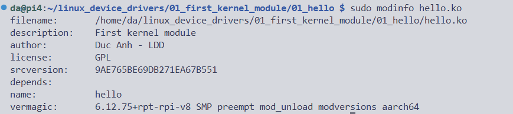
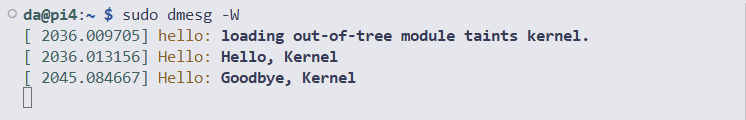

# Hello kernel

## Các câu lệnh đã được sử dụng
Viết file make file để biên dịch code 

Lệnh biên dịch 'make all' sẽ tạo ra file .ko (file kernel module)

Lệnh 'make clean' để xóa các file chỉ định (dọn dẹp các file đã build)

sudo insmod hello.ko: Nạp module vào kernel

sudo rmmod hello : Gỡ module

lsmod | grep hello : Kiểm tra module đã được load chưa

## Xem thông tin của module
sudo modinfo hello.ko

## Xem log kernel

sudo dmesg -W
