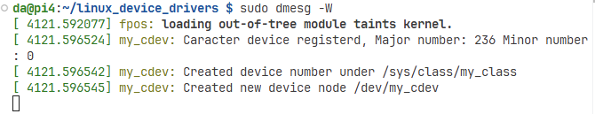
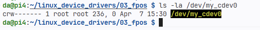
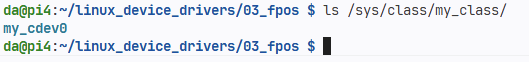
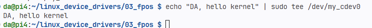
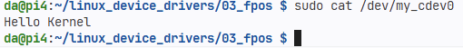
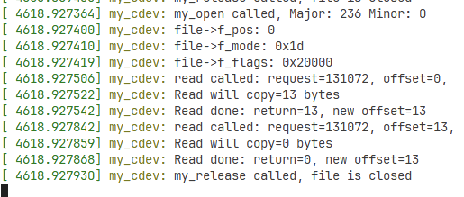
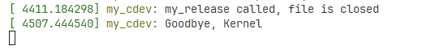

# Linux Character Device Driver — Giải thích chi tiết

## Kiến trúc tổng quan

```
User Space              Kernel Space
──────────────          ──────────────────────────────────────
open()         ──►      my_open()
read()         ──►      my_read()    ──►  dev_buffer (64 bytes)
write()        ──►      my_write()   ◄──  dev_buffer (64 bytes)
close()        ──►      my_release()
```

Toàn bộ module hoạt động như một **bộ nhớ chia sẻ 64 bytes** giữa user-space và kernel-space, được truy cập thông qua file ảo `/dev/my_cdev0`.

---

## 1. Các biến toàn cục quan trọng

```c
static dev_t dev_nr;           // Số thiết bị (gồm Major + Minor number)
static struct cdev my_cdev;    // Đại diện character device trong kernel
static struct class *my_class; // Tạo entry trong /sys/class/
static char *dev_buffer;       // Bộ nhớ kernel 64 bytes — "ổ đĩa ảo"
static struct mutex dev_mutex; // Khóa mutex chống race condition
```

| Biến | Kiểu | Vai trò |
|---|---|---|
| `dev_nr` | `dev_t` | Lưu Major + Minor number do kernel cấp phát |
| `my_cdev` | `struct cdev` | Cấu trúc đại diện cho character device |
| `my_class` | `struct class *` | Tạo class hiển thị trong `/sys/class/` |
| `dev_buffer` | `char *` | Buffer 64 bytes trong kernel — nơi lưu dữ liệu thực sự |
| `dev_mutex` | `struct mutex` | Đảm bảo chỉ một tiến trình đọc/ghi tại một thời điểm |

---

## 2. `my_init()` — Khởi tạo khi `insmod`

Hàm này chạy khi bạn nạp module vào kernel. Các bước thực hiện theo thứ tự:

```
kmalloc(64 bytes)           → Cấp phát dev_buffer trong kernel memory
mutex_init()                → Khởi tạo mutex
memset(dev_buffer, 0, 64)   → Xóa trắng buffer
alloc_chrdev_region()       → Xin kernel cấp số Major/Minor
cdev_init() + cdev_add()    → Đăng ký character device với kernel
class_create()              → Tạo /sys/class/my_class/
device_create()             → Tạo node /dev/my_cdev0
```

### Xử lý lỗi bằng `goto` — Pattern in kernel

```c
status = cdev_add(...);
if(status) goto free_device_nr;   // Nếu lỗi, nhảy xuống dọn dẹp

my_class = class_create(...);
if(!my_class) goto delete_cdev;   // Nếu lỗi, xóa cdev trước rồi thoát

device_create(...);
if(!device) goto delete_class;    // Nếu lỗi, xóa class trước rồi thoát
```

> **Tại sao dùng `goto`?**  `goto` giúp dọn dẹp tài nguyên theo thứ tự ngược lại một cách rõ ràng và an toàn — đây là convention được chấp nhận rộng rãi trong kernel Linux.

---

## 3. `my_exit()` — Dọn dẹp khi `rmmod`

Hàm này chạy khi gỡ module. Thứ tự dọn dẹp **ngược lại** với `my_init()`:

```c
device_destroy(my_class, dev_nr);          // Xóa /dev/my_cdev0
class_destroy(my_class);                   // Xóa /sys/class/my_class/
cdev_del(&my_cdev);                        // Hủy đăng ký character device
unregister_chrdev_region(dev_nr, ...);     // Trả lại Major/Minor number
mutex_destroy(&dev_mutex);                 // Hủy mutex
kfree(dev_buffer);                         // (Nên có) Giải phóng buffer
```

> **Lưu ý:** Trong code gốc thiếu `kfree(dev_buffer)` ở `my_exit()` — đây là một **memory leak** nhỏ. Trong thực tế nên thêm dòng này trước khi module thoát.

---

## 4. File Operations

Đây là phần quan trọng của driver. Kernel biết gọi hàm nào thông qua struct:

```c
static struct file_operations fops = {
    .open    = my_open,
    .release = my_release,
    .read    = my_read,
    .write   = my_write,
};
```

---

### 4.1 `my_open()` — Khi user mở file

```c
static int my_open(struct inode *pInode, struct file *pFile) {
    pr_info("my_open called, Major: %d Minor: %d\n", imajor(pInode), iminor(pInode));
    pr_info("file->f_pos: %lld\n",   pFile->f_pos);    // Vị trí con trỏ (= 0)
    pr_info("file->f_mode: 0x%x\n",  pFile->f_mode);   // Chế độ: read/write
    pr_info("file->f_flags: 0x%x\n", pFile->f_flags);  // Flags: O_RDONLY, O_WRONLY...
    return 0;
}
```

Hàm này chỉ log thông tin, không làm gì thêm. Trong driver thực tế, đây là nơi để cấp phát tài nguyên riêng cho từng file handle nếu cần.

---

### 4.2 `my_release()` — Khi user đóng file

```c
static int my_release(struct inode *pInode, struct file *pFile) {
    pr_info("my_release called, file is closed\n");
    return 0;
}
```

Đối xứng với `my_open()`. Trong driver phức tạp hơn, đây là nơi giải phóng tài nguyên đã cấp phát trong `open`.

---

### 4.3 `my_read()` — Copy dữ liệu từ kernel → user

```c
static ssize_t my_read(struct file *pFile, char __user *pUser_buff,
                        size_t count, loff_t *pOffset) {

    // 1. Khóa mutex — chỉ 1 tiến trình được đọc tại một thời điểm
    if(mutex_lock_interruptible(&dev_mutex))
        return -ERESTARTSYS;

    // 2. Tính số byte thực sự có thể copy
    //    Không được đọc vượt quá dữ liệu có trong buffer
    bytes_to_copy = (count + *pOffset > strlen(dev_buffer))
                    ? (strlen(dev_buffer) - *pOffset)
                    : count;

    // 3. Copy từ kernel buffer → user buffer (KHÔNG được dùng memcpy!)
    not_copied = copy_to_user(pUser_buff, dev_buffer + *pOffset, bytes_to_copy);
    copied = bytes_to_copy - not_copied;

    // 4. Cập nhật offset (con trỏ vị trí đọc)
    *pOffset += copied;

    // 5. Mở khóa mutex
    mutex_unlock(&dev_mutex);

    return (ssize_t)copied; // Trả về số byte đã copy thành công
}
```

**Tại sao phải dùng `copy_to_user` thay vì `memcpy`?**  
Vì user-space pointer có thể không hợp lệ, có thể nằm trong vùng swap, hoặc thuộc page chưa được map. `copy_to_user` xử lý tất cả các trường hợp này an toàn và có thể trả về số byte chưa copy được.

---

### 4.4 `my_write()` — Copy dữ liệu từ user → kernel

```c
static ssize_t my_write(struct file *pFile, const char __user *pUser_buff,
                         size_t count, loff_t *pOffset) {

    // 1. Khóa mutex
    if(mutex_lock_interruptible(&dev_mutex))
        return -ERESTARTSYS;

    // 2. Kiểm tra còn chỗ trong buffer không
    if(*pOffset >= DEV_BUFFER_SIZE) {
        mutex_unlock(&dev_mutex);
        return -ENOSPC;                          // Lỗi: hết chỗ
    } else if(count > DEV_BUFFER_SIZE - *pOffset) {
        bytes_to_copy = DEV_BUFFER_SIZE - *pOffset; // Chỉ ghi phần còn lại
    } else {
        bytes_to_copy = count;                   // Ghi toàn bộ yêu cầu
    }

    // 3. Copy từ user buffer → kernel buffer
    not_copied = copy_from_user(dev_buffer + *pOffset, pUser_buff, bytes_to_copy);
    copied = bytes_to_copy - not_copied;

    // 4. Cập nhật offset
    *pOffset += copied;

    // 5. Mở khóa mutex
    mutex_unlock(&dev_mutex);

    return (ssize_t)copied;
}
```

**Sơ đồ ghi dữ liệu:**
```
User buffer: [ H | e | l | l | o ]
                                        copy_from_user()
dev_buffer:  [ H | e | l | l | o | 0 | 0 | 0 | ... ] (64 bytes)
              ^
              pOffset ban đầu = 0, sau khi ghi = 5
```

---

## 5. Mutex — Chống Race Condition

```c
// Tiến trình 1 (đang ghi)          // Tiến trình 2 (muốn đọc)
mutex_lock(&dev_mutex);             mutex_lock(&dev_mutex);  ← BLOCKED, chờ
  copy_from_user(...);
  *pOffset += copied;
mutex_unlock(&dev_mutex);           ← Tiến trình 2 được tiếp tục
                                      copy_to_user(...);
                                    mutex_unlock(&dev_mutex);
```

Nếu không có mutex và 2 tiến trình cùng ghi vào `dev_buffer` đồng thời, dữ liệu sẽ bị **corruption** — đây là dạng bug rất khó debug (race condition).

`mutex_lock_interruptible` khác `mutex_lock` ở chỗ: nếu tiến trình đang chờ mutex mà nhận được signal (ví dụ Ctrl+C), nó sẽ thoát ra và trả về `-ERESTARTSYS` thay vì bị treo vĩnh viễn.

---

## 6. Thử nghiệm thực tế

```bash
    # Nạp module vào kernel
    sudo insmod fops.ko
```


```bash
    # Kiểm tra device đã tạo chưa
    ls -la /dev/my_cdev0
```



```bash
    # Kiểm tra class đã tạo chưa
    ls /sys/class/my_class/
```


```bash
    # Ghi dữ liệu vào device
    echo "Hello Kernel" | sudo tee /dev/my_cdev0
```


```bash
    # Đọc dữ liệu từ device
    cat /dev/my_cdev0
    # Output: Hello Kernel
```



```bash
    # Xem kernel log
    dmesg -W
```
```bash
    # Gỡ module
    sudo rmmod fpos
```



---

## 7. Luồng dữ liệu hoàn chỉnh

```
[WRITE]
echo "Hi" > /dev/my_cdev0
    │
    ▼
my_open()          → Mở file, log thông tin
    │
    ▼
my_write()
    ├─ mutex_lock()
    ├─ Kiểm tra buffer còn chỗ
    ├─ copy_from_user("Hi" → dev_buffer[0..1])
    ├─ *pOffset = 2
    └─ mutex_unlock()
    │
    ▼
my_release()       → Đóng file

━━━━━━━━━━━━━━━━━━━━━━━━━━━━━━━━━━━━

[READ]
cat /dev/my_cdev0
    │
    ▼
my_open()          → Mở file, pOffset = 0
    │
    ▼
my_read()
    ├─ mutex_lock()
    ├─ bytes_to_copy = strlen("Hi") - 0 = 2
    ├─ copy_to_user(dev_buffer → user_buffer)
    ├─ *pOffset = 2
    └─ mutex_unlock()
    │
    ▼
my_read() lần 2    → bytes_to_copy = 0, return 0 (EOF)
    │
    ▼
my_release()       → Đóng file, in ra "Hi"
```

---
